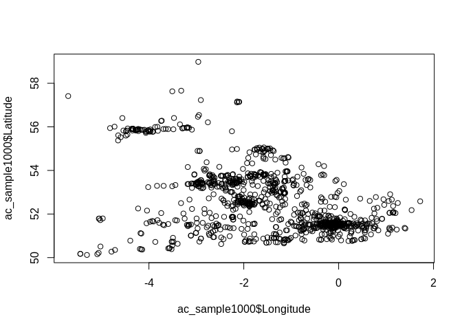

[](https://ci.appveyor.com/project/Robinlovelace/stats19)

<!-- README.md is generated from README.Rmd. Please edit that file -->

# stats19

The primary goal of stats19 is to enable access to the UK’s
geo-referenced database of road traffic casualties compiled by the
police. See <https://data.gov.uk/dataset/road-accidents-safety-data> for
further details. The package also aims to ease the analysis of such data
to prioritise transport policies.

## Installation

You can install stats19 from github with:

``` r
# install.packages("devtools")
devtools::install_github("cyipt/stats19")
library(stats19)
```

``` r
ac <- read_stats19_ac()
ca <- read_stats19_ca()
ve <- read_stats19_ve()
```

``` r
set.seed(2018)
ac_sample1000 = ac[sample(nrow(ac), 1000), ]
```

``` r
plot(ac_sample1000$Longitude, ac_sample1000$Latitude)
```

<!-- -->
